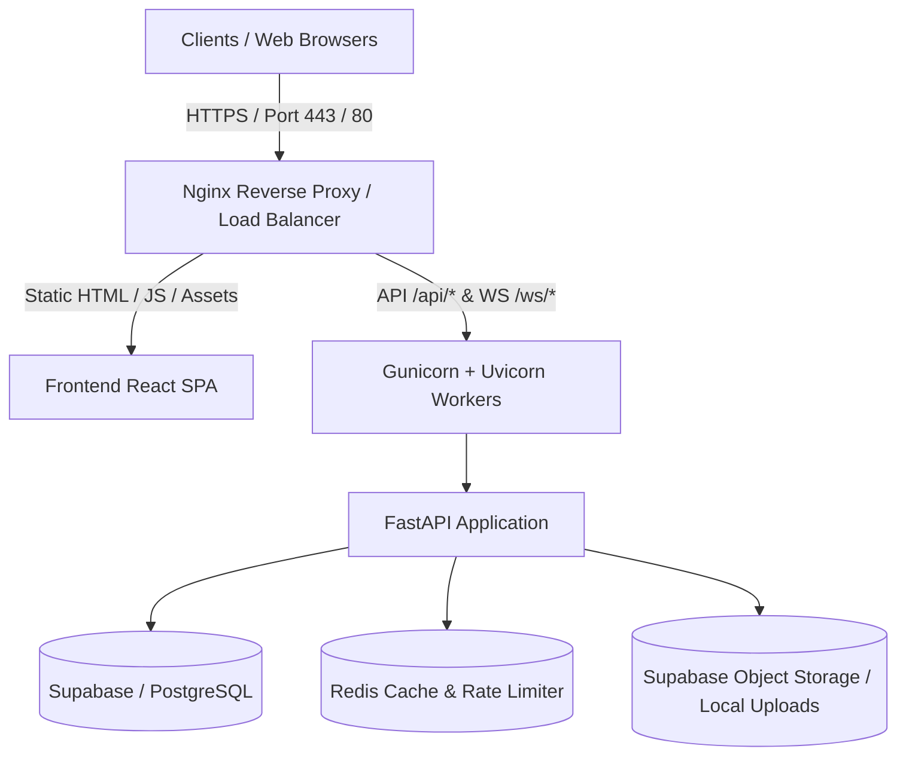

# Production Deployment Guide & Operations Runbook

This guide provides step-by-step instructions for deploying the **Student Management System / College ERP** to production across multiple target platforms: **Docker Compose**, **Render / AWS / VPS**, and **Vercel + Supabase**.

---

## 1. Production Architecture Overview



---

## 2. Deployment Method A: Docker Compose (Recommended for Self-Hosting / VPS)

### Prerequisites
- Docker (v24.0+) & Docker Compose (v2.20+)
- Domain name pointed to your server IP (A Record)
- Open ports: `80` (HTTP), `443` (HTTPS)

### Step-by-Step Instructions

1. **Clone the Repository**:
   ```bash
   git clone https://github.com/hatafRakshi07/student-management-system.git
   cd student-management-system
   ```

2. **Configure Environment Variables**:
   ```bash
   cp .env.example .env
   ```
   Edit `.env` and configure:
   - `SECRET_KEY`: Generate a random 32+ character key:
     ```bash
     python -c "import secrets; print(secrets.token_urlsafe(32))"
     ```
   - `DATABASE_URL`: Your PostgreSQL connection string.
   - `ENVIRONMENT=production`
   - `DEBUG=false`
   - `ALLOWED_ORIGINS=https://yourdomain.com`

3. **Build and Launch the Stack**:
   ```bash
   docker compose up -d --build
   ```

4. **Verify Container Health**:
   ```bash
   docker compose ps
   ```
   All services (`college_erp_backend`, `college_erp_frontend`, `college_erp_redis`) should report `healthy`.

5. **Test Backend Health Endpoint**:
   ```bash
   curl http://localhost:8000/health
   # Expected: {"status":"healthy","database":"connected","version":"1.0.0",...}
   ```

---

## 3. Deployment Method B: Render / Cloud Platform

### Backend Service (Web Service)
- **Environment**: Python 3.10 / 3.11
- **Build Command**: `pip install -r requirements.txt`
- **Start Command**: `gunicorn -w 4 -k uvicorn.workers.UvicornWorker app.main:app -b 0.0.0.0:$PORT`
- **Environment Variables**:
  - `DATABASE_URL`: `postgresql+psycopg2://...`
  - `SECRET_KEY`: `[Your 32+ character key]`
  - `ENVIRONMENT`: `production`
  - `DEBUG`: `false`

### Frontend Service (Static Site)
- **Root Directory**: `frontend`
- **Build Command**: `npm install && npm run build`
- **Publish Directory**: `dist`
- **Environment Variables**:
  - `VITE_API_BASE_URL`: `https://your-backend-service.onrender.com/api`
- **Rewrite Rule**: `/*` -> `/index.html`

---

## 4. Deployment Method C: Vercel + Supabase (Serverless)

1. **Deploy Backend API**:
   - Vercel automatically detects `api/index.py` (via Mangum).
   - Set environment variables in Vercel Project Settings (`DATABASE_URL`, `SECRET_KEY`, `SUPABASE_URL`, `SUPABASE_SERVICE_KEY`).

2. **Deploy Frontend SPA**:
   - Build Command: `cd frontend && npm install && npm run build`
   - Output Directory: `frontend/dist`
   - Rewrite rules are preconfigured in `vercel.json`.

---

## 5. Security Checklist for Production

- [x] **Secret Key**: Ensure `SECRET_KEY` is not the default fallback value.
- [x] **Demo Authentication**: Ensure `ENABLE_DEMO_AUTH=false` in production.
- [x] **Debug Mode**: Set `DEBUG=false` to prevent internal stack trace disclosure.
- [x] **CORS Origins**: Explicitly set `ALLOWED_ORIGINS` to valid domain names.
- [x] **SSL / HTTPS**: Enforce HTTPS via Cloudflare, Let's Encrypt Certbot, or AWS ALB.
- [x] **Security Headers**: HSTS, X-Content-Type-Options (nosniff), X-Frame-Options (DENY), Referrer-Policy enabled.
- [x] **Database SSL**: Ensure `sslmode=require` is active for cloud database connections.
- [x] **Rate Limiting**: SlowAPI / Redis rate limiting enabled on sensitive authentication endpoints.

---

## 6. Maintenance, Backups & Monitoring

### Database Backups (PostgreSQL)
```bash
# Export full database dump
pg_dump -U postgres -h [DB_HOST] -d [DB_NAME] -F c -b -v -f backup_$(date +%Y%m%d).dump

# Restore from dump
pg_restore -U postgres -h [DB_HOST] -d [DB_NAME] -v backup_20260905.dump
```

### Health & Readiness Probes
- **Liveness & Health Probe**: `GET /health` or `GET /api/health`
- **API Documentation**: `GET /docs` (Auto-generated Swagger OpenAPI)
- **Logs Inspection**:
  ```bash
  docker compose logs -f backend
  ```
