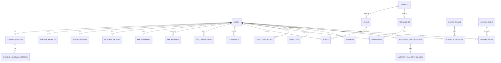

# Complete Master Database Schema Specification

**Project:** Aklank College AI-Powered Enterprise ERP & Student Management System  
**Institution:** Aklank Girls P.G. College, Kota (Raj.)  
**Database Engine:** PostgreSQL / Supabase  
**Total Database Tables:** 35 Tables  

---

## 1. Master System ER Diagram



---

## 2. Complete SQL DDL Statements (`CREATE TABLE`)

```sql
-- 1. USERS TABLE
CREATE TABLE users (
    id SERIAL PRIMARY KEY,
    username VARCHAR(100) UNIQUE NOT NULL,
    email VARCHAR(255) UNIQUE NOT NULL,
    full_name VARCHAR(255) NOT NULL,
    hashed_password VARCHAR(255) NOT NULL,
    role VARCHAR(50) NOT NULL CHECK (role IN ('STUDENT', 'TEACHER', 'ADMIN', 'PARENT')),
    phone VARCHAR(20),
    profile_photo VARCHAR(500),
    is_active BOOLEAN DEFAULT TRUE,
    last_login TIMESTAMP,
    created_at TIMESTAMP DEFAULT CURRENT_TIMESTAMP
);

-- 2. STUDENT PROFILES TABLE
CREATE TABLE student_profiles (
    id SERIAL PRIMARY KEY,
    user_id INT UNIQUE REFERENCES users(id) ON DELETE CASCADE,
    roll_number VARCHAR(50) UNIQUE NOT NULL,
    reg_no VARCHAR(50),
    admission_no VARCHAR(50),
    student_name VARCHAR(255) NOT NULL,
    father_name VARCHAR(255),
    mother_name VARCHAR(255),
    department VARCHAR(100) DEFAULT 'Arts',
    class_name VARCHAR(100) NOT NULL,
    section VARCHAR(20) DEFAULT 'A',
    semester INT DEFAULT 1,
    year INT DEFAULT 1,
    date_of_birth DATE,
    gender VARCHAR(20) DEFAULT 'Female',
    category VARCHAR(50) DEFAULT 'General',
    mobile VARCHAR(20),
    father_mobile VARCHAR(20),
    mother_mobile VARCHAR(20),
    status VARCHAR(50) DEFAULT 'ACTIVE',
    created_at TIMESTAMP DEFAULT CURRENT_TIMESTAMP
);

-- 3. TEACHER PROFILES TABLE
CREATE TABLE teacher_profiles (
    id SERIAL PRIMARY KEY,
    user_id INT UNIQUE REFERENCES users(id) ON DELETE CASCADE,
    employee_id VARCHAR(50) UNIQUE NOT NULL,
    department VARCHAR(100) NOT NULL,
    designation VARCHAR(100) DEFAULT 'Assistant Professor',
    qualification VARCHAR(255),
    specialization VARCHAR(255),
    joining_date DATE DEFAULT CURRENT_DATE,
    created_at TIMESTAMP DEFAULT CURRENT_TIMESTAMP
);

-- 4. PARENT PROFILES TABLE
CREATE TABLE parent_profiles (
    id SERIAL PRIMARY KEY,
    user_id INT UNIQUE REFERENCES users(id) ON DELETE CASCADE,
    occupation VARCHAR(100),
    address TEXT,
    emergency_contact VARCHAR(20),
    created_at TIMESTAMP DEFAULT CURRENT_TIMESTAMP
);

-- 5. FEE SUMMARY TABLE
CREATE TABLE fee_summaries (
    id SERIAL PRIMARY KEY,
    student_id INT UNIQUE REFERENCES users(id) ON DELETE CASCADE,
    total_fee FLOAT DEFAULT 0.0,
    total_paid FLOAT DEFAULT 0.0,
    pending_fee FLOAT DEFAULT 0.0,
    current_status VARCHAR(50) DEFAULT 'UNPAID',
    updated_at TIMESTAMP DEFAULT CURRENT_TIMESTAMP
);

-- 6. FEE RECEIPTS TABLE
CREATE TABLE fee_receipts (
    receipt_id SERIAL PRIMARY KEY,
    student_id INT REFERENCES users(id) ON DELETE CASCADE,
    receipt_no VARCHAR(100) NOT NULL,
    voucher_no VARCHAR(100),
    amount FLOAT NOT NULL,
    discount FLOAT DEFAULT 0.0,
    fine FLOAT DEFAULT 0.0,
    late_fee FLOAT DEFAULT 0.0,
    payment_mode VARCHAR(50) DEFAULT 'CASH',
    bank_name VARCHAR(100),
    receipt_date DATE DEFAULT CURRENT_DATE,
    session VARCHAR(50) DEFAULT '2023-24',
    remarks TEXT,
    created_by VARCHAR(100) DEFAULT 'System Administrator',
    created_at TIMESTAMP DEFAULT CURRENT_TIMESTAMP
);

-- 7. FEE TRANSACTIONS TABLE
CREATE TABLE fee_transactions (
    id SERIAL PRIMARY KEY,
    student_id INT REFERENCES users(id) ON DELETE SET NULL,
    reg_no VARCHAR(50),
    scholar_no VARCHAR(50),
    student_name VARCHAR(255) NOT NULL,
    father_name VARCHAR(255),
    class_name VARCHAR(100),
    section VARCHAR(20),
    mobile_no VARCHAR(20),
    paid_amount FLOAT DEFAULT 0.0,
    installment VARCHAR(100),
    created_at TIMESTAMP DEFAULT CURRENT_TIMESTAMP
);

-- 8. HOSTEL ROOMS TABLE
CREATE TABLE hostel_rooms (
    id SERIAL PRIMARY KEY,
    room_number VARCHAR(50) UNIQUE NOT NULL,
    block_wing VARCHAR(100) DEFAULT 'Girls Hostel Block A',
    floor INT DEFAULT 1,
    capacity INT DEFAULT 2,
    occupied_count INT DEFAULT 0,
    monthly_rent FLOAT DEFAULT 3500.0,
    facilities VARCHAR(255) DEFAULT 'AC, WiFi, Study Table',
    status VARCHAR(50) DEFAULT 'AVAILABLE'
);

-- 9. HOSTEL ALLOCATIONS TABLE
CREATE TABLE hostel_allocations (
    id SERIAL PRIMARY KEY,
    room_id INT REFERENCES hostel_rooms(id) ON DELETE CASCADE,
    student_id INT REFERENCES users(id) ON DELETE CASCADE,
    allotted_date DATE DEFAULT CURRENT_DATE,
    mess_plan VARCHAR(100) DEFAULT 'Full Mess (Veg/Jain)',
    fee_status VARCHAR(50) DEFAULT 'PAID'
);

-- 10. INVENTORY ASSET RECORDS TABLE
CREATE TABLE inventory_asset_records (
    id SERIAL PRIMARY KEY,
    asset_code VARCHAR(50) UNIQUE NOT NULL,
    barcode_token VARCHAR(100),
    qr_code_token VARCHAR(100),
    item_name VARCHAR(255) NOT NULL,
    category VARCHAR(100) DEFAULT 'Computers & IT',
    location VARCHAR(100) DEFAULT 'Main Lab 1',
    purchase_price FLOAT DEFAULT 0.0,
    purchase_date DATE DEFAULT CURRENT_DATE,
    condition VARCHAR(50) DEFAULT 'Good',
    status VARCHAR(50) DEFAULT 'AVAILABLE',
    assigned_user_id INT REFERENCES users(id) ON DELETE SET NULL,
    created_at TIMESTAMP DEFAULT CURRENT_TIMESTAMP
);

-- 11. ATTENDANCE TABLE
CREATE TABLE attendance (
    id SERIAL PRIMARY KEY,
    student_id INT REFERENCES users(id) ON DELETE CASCADE,
    subject_id INT,
    date DATE NOT NULL,
    status VARCHAR(20) NOT NULL CHECK (status IN ('PRESENT', 'ABSENT', 'LATE', 'EXCUSED')),
    remarks VARCHAR(255),
    marked_by INT REFERENCES users(id) ON DELETE SET NULL,
    created_at TIMESTAMP DEFAULT CURRENT_TIMESTAMP
);

-- 12. EXAMS TABLE
CREATE TABLE exams (
    id SERIAL PRIMARY KEY,
    title VARCHAR(255) NOT NULL,
    exam_type VARCHAR(50) NOT NULL,
    subject_id INT,
    class_name VARCHAR(100),
    total_marks FLOAT DEFAULT 100.0,
    passing_marks FLOAT DEFAULT 33.0,
    exam_date DATE,
    created_at TIMESTAMP DEFAULT CURRENT_TIMESTAMP
);

-- 13. MARKS TABLE
CREATE TABLE marks (
    id SERIAL PRIMARY KEY,
    exam_id INT REFERENCES exams(id) ON DELETE CASCADE,
    student_id INT REFERENCES users(id) ON DELETE CASCADE,
    marks_obtained FLOAT NOT NULL,
    grade VARCHAR(10),
    remarks VARCHAR(255),
    created_at TIMESTAMP DEFAULT CURRENT_TIMESTAMP
);

-- 14. ASSIGNMENTS TABLE
CREATE TABLE assignments (
    id SERIAL PRIMARY KEY,
    title VARCHAR(255) NOT NULL,
    description TEXT,
    subject_id INT,
    teacher_id INT REFERENCES users(id) ON DELETE CASCADE,
    class_name VARCHAR(100),
    due_date TIMESTAMP NOT NULL,
    max_marks FLOAT DEFAULT 100.0,
    is_active BOOLEAN DEFAULT TRUE,
    created_at TIMESTAMP DEFAULT CURRENT_TIMESTAMP
);

-- 15. SUBMISSIONS TABLE
CREATE TABLE submissions (
    id SERIAL PRIMARY KEY,
    assignment_id INT REFERENCES assignments(id) ON DELETE CASCADE,
    student_id INT REFERENCES users(id) ON DELETE CASCADE,
    file_url VARCHAR(500),
    submission_text TEXT,
    submitted_at TIMESTAMP DEFAULT CURRENT_TIMESTAMP,
    marks_obtained FLOAT,
    feedback TEXT,
    status VARCHAR(50) DEFAULT 'SUBMITTED'
);

-- 16. NOTICES TABLE
CREATE TABLE notices (
    id SERIAL PRIMARY KEY,
    title VARCHAR(255) NOT NULL,
    content TEXT NOT NULL,
    target_role VARCHAR(50) DEFAULT 'ALL',
    category VARCHAR(50) DEFAULT 'General',
    attachment_url VARCHAR(500),
    posted_by INT REFERENCES users(id) ON DELETE SET NULL,
    is_important BOOLEAN DEFAULT FALSE,
    created_at TIMESTAMP DEFAULT CURRENT_TIMESTAMP
);

-- 17. AUDIT LOGS TABLE
CREATE TABLE audit_logs (
    id SERIAL PRIMARY KEY,
    user_id INT REFERENCES users(id) ON DELETE SET NULL,
    action VARCHAR(100) NOT NULL,
    ip_address VARCHAR(50),
    timestamp TIMESTAMP DEFAULT CURRENT_TIMESTAMP
);

-- 18. ARCHIVED STUDENTS TABLE
CREATE TABLE archived_students (
    id SERIAL PRIMARY KEY,
    reg_no VARCHAR(50),
    roll_number VARCHAR(50),
    student_name VARCHAR(255) NOT NULL,
    father_name VARCHAR(255),
    mobile VARCHAR(20),
    class_name VARCHAR(100),
    academic_session VARCHAR(50) DEFAULT '2023-24',
    admission_year VARCHAR(20),
    current_status VARCHAR(50) DEFAULT 'ARCHIVED',
    created_at TIMESTAMP DEFAULT CURRENT_TIMESTAMP
);
```

---

## 3. Module-by-Module Data Dictionary

### Module 1: Authentication & User Accounts (`users`)
- **`id`**: Auto-increment integer primary key.
- **`username`**: Unique login username (normalized lowercase, no spaces).
- **`email`**: User email address.
- **`hashed_password`**: Bcrypt salted password hash.
- **`role`**: System access control role (`STUDENT`, `TEACHER`, `ADMIN`, `PARENT`).
- **`phone`**: Contact mobile number used as default login password.

### Module 2: Student Master Dossier (`student_profiles`)
- **`roll_number`**: College scholar number / roll number.
- **`reg_no`**: University registration number.
- **`admission_no`**: College admission form number.
- **`student_name`**: Official full student name.
- **`father_name`**: Father's name.
- **`mother_name`**: Mother's name (placeholder values clean-filtered to `NULL`).
- **`department`**: Academic department (`Arts`, `Computer Applications`, `Commerce`, `Science`).
- **`class_name`**: Course & Class (`B.A`, `B.C.A`, `B.Com`, `B.Sc`, `M.A`).

### Module 3: Financial ERP & Fee Ledger (`fee_receipts`, `fee_transactions`, `fee_summaries`)
- **`total_fee`**: Course fee structure total.
- **`total_paid`**: Net fees paid across all receipts and installments.
- **`pending_fee`**: Remaining dues balance (`total_fee` - `total_paid`).
- **`receipt_no` / `voucher_no`**: Official transaction reference receipt voucher.

### Module 4: Hostel & Facilities ERP (`hostel_rooms`, `hostel_allocations`)
- **`room_number`**: Unique hostel room identifier (101, 102, 201).
- **`block_wing`**: Hostel building block (`Girls Hostel Block A`, `Block B PG`).
- **`capacity` & `occupied_count`**: Bed capacity and current live occupancy.
- **`monthly_rent`**: Monthly rent fee (₹).

### Module 5: Inventory & Assets ERP (`inventory_asset_records`)
- **`asset_code`**: Asset barcode / QR token code (`AST-CS-001`).
- **`item_name`**: Equipment description (Dell Desktop, HP Printer, Projector).
- **`category`**: Asset classification (`Computers & IT`, `Lab Equipment`).
- **`purchase_price`**: Capital asset purchase cost (₹).

---

## 4. Database Foreign Key Relationships & Indexes

1. **`student_profiles.user_id` ➔ `users.id`**: `ON DELETE CASCADE`
2. **`fee_receipts.student_id` ➔ `users.id`**: `ON DELETE CASCADE`
3. **`fee_transactions.student_id` ➔ `users.id`**: `ON DELETE SET NULL`
4. **`hostel_allocations.student_id` ➔ `users.id`**: `ON DELETE CASCADE`
5. **`attendance.student_id` ➔ `users.id`**: `ON DELETE CASCADE`
6. **`marks.student_id` ➔ `users.id`**: `ON DELETE CASCADE`
7. **`audit_logs.user_id` ➔ `users.id`**: `ON DELETE SET NULL`

---

## 5. Summary Table Matrix

| Module Name | Primary Table | Total Columns | Foreign Keys | Status |
| :--- | :--- | :---: | :---: | :---: |
| **Authentication** | `users` | 10 | 0 | Live Sync |
| **Student Master** | `student_profiles` | 21 | 1 | Live Sync (756 Recs) |
| **Faculty & Staff** | `teacher_profiles` | 9 | 1 | Live Sync |
| **Fee Ledger** | `fee_transactions` | 11 | 1 | Live Sync (2,527 Recs) |
| **Hostel ERP** | `hostel_rooms` | 9 | 0 | Live Sync (8 Rooms) |
| **Inventory ERP** | `inventory_asset_records` | 12 | 1 | Live Sync (8 Assets) |
| **Archival Engine** | `archived_students` | 11 | 0 | Live Sync (1,053 Recs) |
